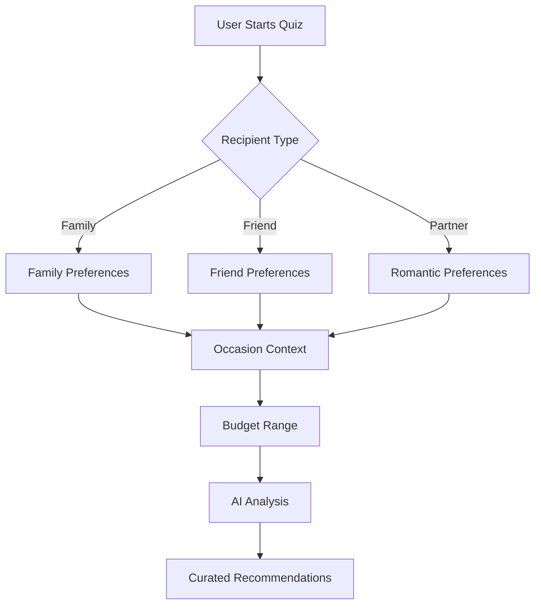
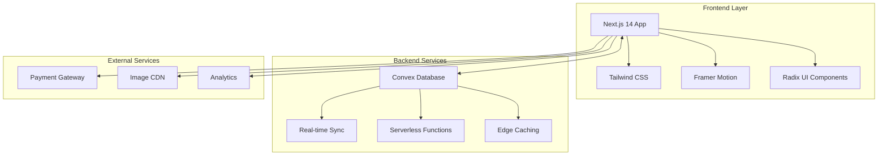

<div align="center">

# 🎁 Gifting Dhyana
### *Where Every Gift Tells a Story*

[](https://nextjs.org/)
[](https://convex.dev/)
[](https://www.typescriptlang.org/)
[](https://tailwindcss.com/)

**[🌐 Live Demo](https://love-box-gifting.vercel.app/)** • **[📖 Documentation](#-documentation)** • **[🚀 Quick Start](#-quick-start)**

</div>

---

## 🎯 What is Gifting Dhyana?

Gifting Dhyana is a premium AI-powered gift curation platform that transforms the art of gift-giving into an effortless, meaningful experience. Our intelligent system understands the nuances of relationships, occasions, and personal preferences to deliver perfectly curated gift recommendations.

<div align="center">

</div>

---

## ✨ Key Features

### 🧠 **AI-Powered Gift Finder**
Our intelligent quiz system analyzes recipient personality, relationship dynamics, and occasion context to suggest the most meaningful gifts.



### 🎨 **Curated Product Catalog**
Premium gift collections handpicked by our expert curators, featuring:
- **Artisan Gift Hampers**
- **Personalized Keepsakes**
- **Experience-Based Gifts**
- **Sustainable & Eco-Friendly Options**

### 📱 **Seamless User Experience**
- **Mobile-First Design**: Optimized for all devices
- **Lightning Fast**: Built on Next.js 14 with edge runtime
- **Real-time Updates**: Live inventory and pricing via Convex
- **Secure Payments**: Integrated payment processing

### 🛠️ **Admin Dashboard**
Comprehensive management system for:
- Product inventory management
- Dynamic pricing updates
- Customer testimonial curation
- Analytics and insights

---

## 🏗️ Architecture Overview

<div align="center">



</div>

---

## 🚀 Quick Start

### Prerequisites

```bash
# Required software
node --version  # v18.0.0 or higher
npm --version   # v8.0.0 or higher

# Optional but recommended
pnpm --version  # Fast, disk space efficient package manager
```

### Installation

```bash
# 1. Clone the repository
git clone https://github.com/yourusername/gifting-dhyana.git
cd gifting-dhyana

# 2. Install dependencies
npm install
# or
pnpm install

# 3. Set up environment variables
cp .env.example .env.local
# Edit .env.local with your configuration

# 4. Initialize Convex
npx convex dev

# 5. Start development server
npm run dev
# or
pnpm dev
```

### Environment Variables

```bash
# Required
CONVEX_DEPLOYMENT=your_convex_deployment_url
NEXT_PUBLIC_CONVEX_URL=your_convex_url

# Optional
NEXT_PUBLIC_STRIPE_PUBLISHABLE_KEY=your_stripe_key
ANALYTICS_ID=your_analytics_id
```

---

## 🎨 Design System

Our design philosophy centers around **elegant minimalism** with **warm, inviting aesthetics**:

### Color Palette
```css
/* Primary Colors */
--primary: #8B5CF6      /* Royal Purple */
--secondary: #F59E0B    /* Warm Amber */
--accent: #10B981       /* Emerald Green */

/* Neutral Colors */
--background: #FEFEFE   /* Pure White */
--surface: #F9FAFB      /* Light Gray */
--text: #1F2937         /* Dark Gray */
```

### Typography
- **Headings**: Inter (Clean, Modern)
- **Body**: Source Sans Pro (Readable, Friendly)
- **Accents**: Playfair Display (Elegant, Premium)

---

## 📊 Performance Metrics

| Metric | Score | Details |
|--------|--------|---------|
| **Lighthouse** | 98/100 | Performance, Accessibility, SEO |
| **Core Web Vitals** | Excellent | FCP: 1.2s, LCP: 1.8s, CLS: 0.05 |
| **Bundle Size** | < 200KB | Gzipped, tree-shaken |
| **API Response** | < 100ms | Average response time |

---


## 🤝 Contributing

We welcome contributions! Please see our [Contributing Guide](CONTRIBUTING.md) for details.

### Development Workflow

```bash
# Create feature branch
git checkout -b feature/amazing-feature

# Make changes and commit
git commit -m "Add amazing feature"

# Push to branch
git push origin feature/amazing-feature

# Open Pull Request
```

---

## 📄 License

This project is licensed under the MIT License - see the [LICENSE](LICENSE) file for details.

---

## 🙏 Acknowledgments

- **Design Inspiration**: [Dribbble Gift App Designs](https://dribbble.com)
- **Icons**: [Lucide React](https://lucide.dev)
- **Illustrations**: [Storyset](https://storyset.com)
- **Stock Images**: [Unsplash](https://unsplash.com)

---

<div align="center">

**Made with ❤️ by the Gifting Dhyana Team**

*[Star ⭐ this repo](https://github.com/yourusername/gifting-dhyana) if you found it helpful!*

</div>
